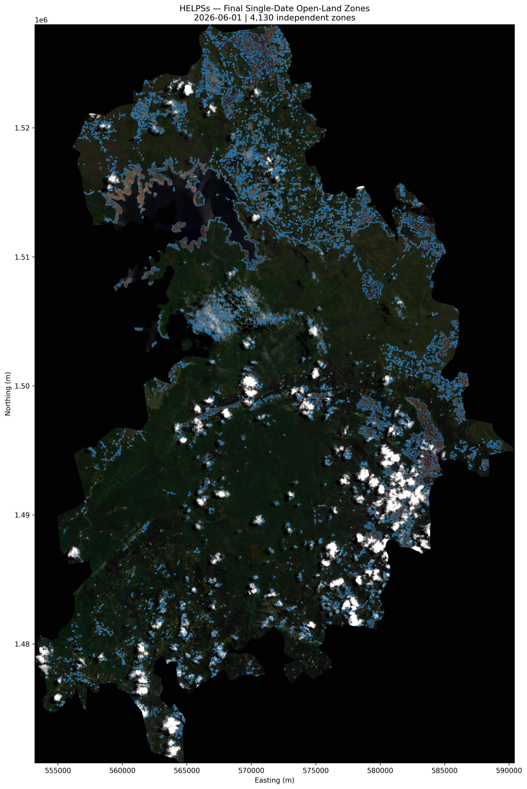
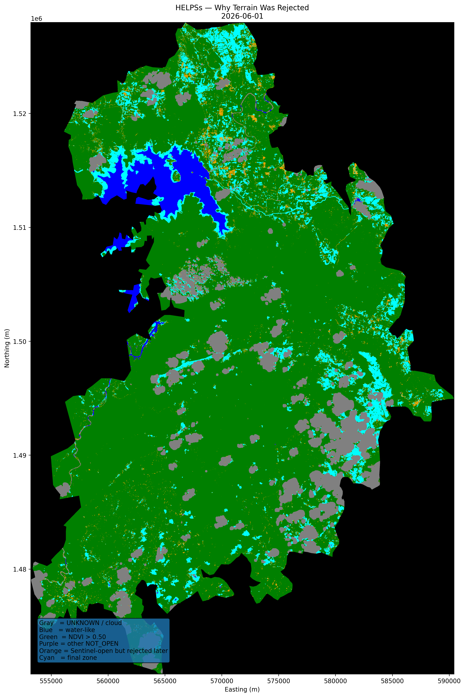

# HELPSs

Helicopter Emergency Landing Place Suggestion System: an explainable, terrain-first research pipeline for **possible open terrain**.

Select an AOI GeoJSON and a Sentinel observation date in the local application. HELPSs reuses verified local inputs or acquires missing Sentinel-2 L2A imagery, OSM context and Overture buildings, runs the established processing stages, and displays the candidate polygons over satellite imagery.



## Current Results

The automated pipeline was rerun against the existing Bhadra inputs for **June 1, 2026**.

| Stage | Result |
|---|---:|
| AOI pixels | 11,073,317 |
| Possible-open pixels | 1,163,689 |
| UNKNOWN pixels inside observed AOI footprint | 1,154,896 |
| Open components | 19,697 |
| Geometry-qualified parents | 5,210 |
| Raw operational zones | 4,898 |
| Final candidate polygons | **4,130** |
| Final candidate area | **88.824 km²** |

The final audit passed: valid geometries, unique IDs, area/dimension/MIC thresholds, stored-area consistency, no positive zone overlaps, and no cloud or UNKNOWN pixel-centre overlaps. Building overlap is below the numerical tolerance of 0.000001 m². Machine-readable results are in [bhadra_summary.json](docs/results/bhadra_summary.json).

The new runner uses the complete AOI building inputs rather than the old prefiltered Overture export. The rerun produced 26,828 intermediate fragments versus the historical 26,827, with identical final polygon count and a total final-area difference of approximately 0.041 m². The original validated GeoPackage and figures are retained unchanged. This is a near-equivalent reproduction, not a claim of byte-identical geometry.



## Run Without The UI

The supported command-line entry point is:

```text
scripts/pipeline/run_aoi_pipeline.py
```

Run it as a Python module from the project root:

```powershell
.\helps_env\Scripts\Activate.ps1
python -m scripts.pipeline.run_aoi_pipeline --aoi "data/raw/Bhadra/bhadra_entire_region.geojson" --date 2026-06-01 --name Bhadra
```

Use the same pattern for any new AOI:

```powershell
python -m scripts.pipeline.run_aoi_pipeline --aoi "<path-to-your-aoi.geojson>" --date YYYY-MM-DD --name "<short_area_name>"
```

The three inputs mean:

| Argument | What to give | Example |
|---|---|---|
| `--aoi` | Path to the main AOI GeoJSON. It must contain valid Polygon or MultiPolygon geometry and a CRS. | `"data/raw/Bhadra/bhadra_entire_region.geojson"` |
| `--date` | Sentinel-2 observation date in `YYYY-MM-DD` format. | `2026-06-01` |
| `--name` | Human-readable run name. This is used in final zone IDs and display text. It is not used for caching. | `"Bhadra"` |

The AOI path can be relative to the project root or an absolute Windows path:

```powershell
python -m scripts.pipeline.run_aoi_pipeline --aoi "C:\Users\manim\OneDrive\Desktop\HELPSs\data\raw\Bhadra\bhadra_entire_region.geojson" --date 2026-06-01 --name Bhadra
```

When the same AOI geometry and date already exist locally, HELPSs reuses verified cached data. For the known Bhadra AOI on `2026-06-01`, it reuses the retained local Sentinel, OSM and Overture inputs. For a new AOI/date, it downloads Sentinel-2 L2A spectral bands and SCL from Copernicus, queries OSM context, downloads Overture buildings, then stores those source inputs under `data/inputs/<geometry-date-key>/<date>/`.

The pipeline always creates a new run folder:

```text
data/runs/<run_id>/
  aoi.geojson
  run.json
  run.log
  summary.json
  final_zones.gpkg
  final_zones.geojson
  final_zones.png
  archive/
    possible_open.tif
    stages.gpkg
```

The most important output for viewing is `final_zones.png`. The most important GIS output is `final_zones.gpkg`, layer `final_open_land_zones`. The JSON summary records pixel counts, candidate counts, final area and audit status.

Each command-line run executes the active test suite first. If any test fails, processing stops before producing a successful result. To skip this only from Python code, call `run(..., run_tests=False)` directly; the CLI intentionally keeps preflight tests on.

Common examples:

```powershell
# Run the validated Bhadra date using retained local data
python -m scripts.pipeline.run_aoi_pipeline --aoi "data/raw/Bhadra/bhadra_entire_region.geojson" --date 2026-06-01 --name Bhadra

# Run another AOI stored inside data/raw
python -m scripts.pipeline.run_aoi_pipeline --aoi "data/raw/MyArea/main_aoi.geojson" --date 2026-06-01 --name MyArea

# Run an AOI from anywhere on the computer
python -m scripts.pipeline.run_aoi_pipeline --aoi "C:\Users\manim\Downloads\aoi.geojson" --date 2026-06-01 --name Field_Check_01
```

## CDSE Credentials

HELPSs uses the Copernicus Data Space Ecosystem Sentinel Hub Process API to fetch Sentinel-2 Level-2A imagery for a user-selected AOI and date. This happens in [scripts/pipeline/acquisition.py](scripts/pipeline/acquisition.py), inside the `sentinel(...)` function.

You need CDSE credentials only when HELPSs must download new Sentinel data. The retained Bhadra `2026-06-01` inputs can be reused locally without a new Sentinel download.

To get the credentials:

1. Sign in to the [Copernicus Data Space Ecosystem](https://dataspace.copernicus.eu/).
2. Open the Sentinel Hub Dashboard from your account/profile area.
3. Go to **User Settings**.
4. Find the **OAuth clients** section.
5. Click **Create**.
6. Give the client a name, for example `HELPSs Local Pipeline`.
7. Use the client credentials flow / non-SPA backend style client.
8. Choose an expiry date, or choose the non-expiring option only if you understand the risk.
9. Create the client.
10. Copy both values immediately:
    - Client ID
    - Client Secret

The client secret is shown only once. If you close the popup without copying it, create a new OAuth client.

Paste the values into a local `.env` file at the project root:

```text
CDSE_CLIENT_ID=your_client_id
CDSE_CLIENT_SECRET=your_client_secret
```

For example:

```text
CDSE_CLIENT_ID=sh-xxxxxxxx-xxxx-xxxx-xxxx-xxxxxxxxxxxx
CDSE_CLIENT_SECRET=your-secret-value-here
```

Do not put quotes around the values unless the value itself requires special shell handling. The `.env` file is ignored by Git, so your secret stays local. The repository includes `.env.example` only as a template.

How HELPSs uses these values:

1. `scripts/pipeline/acquisition.py` reads `.env` with `python-dotenv`.
2. It sends the client ID and secret to the official CDSE OAuth token endpoint.
3. CDSE returns a temporary access token.
4. HELPSs sends that token in the `Authorization: Bearer ...` header when requesting Sentinel imagery.
5. The token is not written to the project folder.

Source: [Copernicus Data Space Ecosystem Sentinel Hub authentication documentation](https://documentation.dataspace.copernicus.eu/APIs/SentinelHub/Overview/Authentication.html).

OSM and Overture downloads also need internet access, but they do not use the CDSE client ID or secret. OSM and Overture are acquisition-time building/context snapshots, not historical snapshots for the Sentinel date.

## Run With The UI

Python 3.10 is the verified environment. From the project root:

```powershell
python -m venv helps_env
.\helps_env\Scripts\Activate.ps1
python -m pip install -r requirements.txt
python -m scripts.ui.server --port 8765
```

Open **http://127.0.0.1:8765**. Select a Polygon/MultiPolygon GeoJSON, enter its name and observation date, and run the analysis. The page shows progress, previous analyses, the final image, and PNG/GeoJSON/GeoPackage/JSON downloads. Use another port if 8765 is occupied.

Credentials stay local. Existing matching Bhadra data can run without new Sentinel authentication.

Each run executes the active test suite before processing. Run the tests separately with:

```powershell
python -m pytest -q
```

## Processing

```text
Validate AOI and date -> verify cached inputs or download missing sources
-> prepare aligned 10 m Sentinel bands and SCL
-> possible-open detection with 30 m cloud buffer
-> polygonization -> exact building subtraction
-> geometry gate -> 15 m morphological opening
-> child geometry gate -> maximum-inscribed-circle gate
-> cloud/UNKNOWN and topology audits -> polygons, image and summary
```

The retained rules are NDVI <= 0.50, MNDWI < 0, observable SCL classes, explicit water exclusion, and UNKNOWN exclusion. The geometry gates are 900 m² minimum area, 30 m length and width, and 30 m maximum clear diameter with 0.5 m polylabel tolerance. Roads remain context; DEM/slope analysis is future work.

No usable observations produce a clear failure asking for another date. An observable AOI with no qualifying land produces a successful, empty polygon result. New downloads use a regional UTM grid; AOIs spanning more than six degrees or exceeding the local 40-million-pixel download limit are rejected.

## Project Layout

```text
scripts/
  pipeline/       Input validation, acquisition, orchestration and final audits
  processing/     Established terrain and geometry algorithms
  validation/     Reusable UNKNOWN overlap audit
  ui/             Local server, HTML, CSS and JavaScript
  archive/        Historical runners, diagnostics, boundary tools and old tests
tests/            Active offline unit and integration tests
docs/
  results/        GitHub-ready reference images and numerical results
  archive/        Historical research documents and papers
  cleanup-manifest.json
data/
  raw/            Authoritative AOI, original Sentinel tiles and DEM sources
  processed/      Retained Bhadra inputs and validated results
  inputs/         Geometry/date-keyed input manifests and downloaded data
  runs/           Independent run folders, final outputs and logs
  validation/     Manual annotations and validation packages
  archive/        Local historical data
archive/          Historical root-level notes, screenshots and QGIS projects
```

Each data directory has an `archive` subdirectory for superseded files. A run's diagnostic mask and intermediate vector layers live under its `archive`; final results remain at the run root. Matching geometry and date determine cache identity, not the user-entered name. Checksums detect changed inputs, and completion manifests prevent partial downloads from being treated as complete.

See [workspace organization](docs/workspace-organization.md) for archive details. Historical scripts are preserved as research history; their original hard-coded paths are not the supported entry point.

See [code responsibility](docs/code-responsibility.md) for a file-by-file explanation of the active codebase.

## GitHub Contents

Source code, archived source, tests, documentation, reference figures and the Bhadra AOI are prepared for Git. Large local rasters, downloaded vectors, run outputs, annotation packages, virtual environments, caches and `.env` are excluded. No repository or remote has been created, and nothing has been uploaded. Use external data storage or Git LFS separately if you decide to publish the large datasets.

## Verification and Scope

The local-data Bhadra pipeline has completed end to end. All 35 active tests pass, covering core algorithms, empty results, AOI/cache behavior, mocked Sentinel acquisition, and local HTTP access restrictions. The UI has been inspected at desktop and mobile sizes, including its AOI file chooser and completed-result downloads.

A separate live acquisition check on a small Bhadra-area polygon successfully downloaded Sentinel spectral/SCL rasters, queried all seven OSM groups, and completed the Overture query (zero buildings in that small test area). The initial sandboxed request was blocked; the live check succeeded with network access enabled. The full Bhadra run reused existing data. The small acquisition-check files are retained under `data/archive/acquisition_smoke`.

These outputs identify possible open terrain. They do not certify helicopter landing suitability: slope, surface strength, operational obstacles, permissions and helicopter-specific constraints are not yet evaluated. Residual thin-cloud contamination missed by single-date Sentinel SCL remains a documented limitation.

\# HELPS Manual Annotations This branch contains the human-verified ground-truth annotations for the HELPS candidate landing regions. 

## Recent Updates - Updated ground-truth GeoJSON annotation layers. - Standardized class labels: \`open\_land\`, \`forest\`, \`buildings\`, \`road\`, \`water\`, \`unknown\`.
